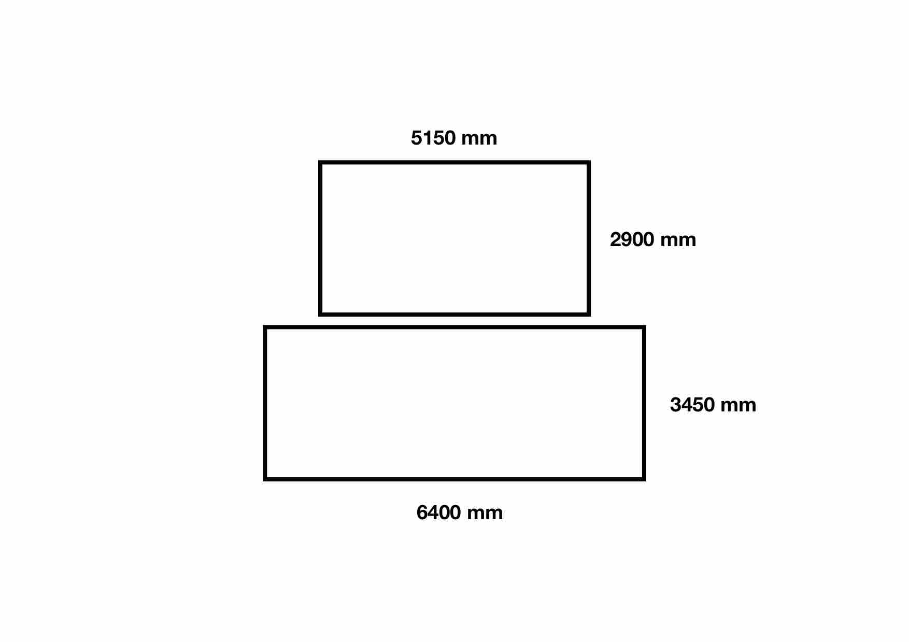

# piwall-setup

Setup Documentation and example config files for Raspberry Pi Video Wall

## Setup

Setup documentation can be found here

- [PiWall Setup](http://www.piwall.co.uk/information/installation)

The `setup.sh` script should cover everything required to setup each Raspberry Pi.

## Config

The documentation for the config files can be found at the [piwall website](http://www.piwall.co.uk/information/configuration-file).
Each Raspberry pi requires a `.piwall` and `.pitile` file in the home folder. These files dictate the layout of the screens, their dimensions and offsets.

### .pitile

The `.pitile` is simply an identifier for that specific Raspberry Pi in the Pi Wall.

It looks like

```bash
[tile]
id=pi?
```

where `?` is a number identifying that pi.

### .piwall

The `.piwall` file is the same for each Raspberry Pi and it has the format

```bash
[Wall_Name]
width=Total_width_in_pixels
height=Total_height_in_pixels
x=X-coordinate-screen-offset
y=Y-coordinate-screen-offset

# corresponding tile definitions
# Repeat for N screens
[Tile_Config_Name_??]
wall=Wall_Name
width=width_in_pixels_of_tile
height=height_in_pixels_of_tile
x=X-offset-in-video
y=Y-offset-in-video

# config
[Config-Name]
pi?=screen_id_?? # Repeat for N screens
```

#### [Wall_Name]

This section defines the total size of the screens and the offset when displaying. If all the screens are the same size, and the video resolution matches, an offset should not be required.

#### [Tile_Config_Name_??]

Tile Config section should be repeated for each screen. The width and height essentially dictate how many pixels to use from the video.

> **Example:**
>
> If you have a video with resolution `1280 x 720` and a screen with native resolution `1280 x 720`, setting:
>
> - `width=1280` and `height=720` will display the video fullscreen
> - `width=640` and `height=360` will under-scan the video and only the top left corner of the video will display
> - `width=2560` and `height=1440` will overscan the video and the full video will be in the top left corner of the display

The `x` and `y` value will shift the starting co-ordinate inside the video

> **Example:**
>
> If you have a video with resolution `1280 x 720` and a screen with native resolution `1280 x 720`, setting:
>
> - `x=640` and `y=360` will display the bottom right corner of the video overscanned.
> - `x=640` and `y=360`,`width=640` and `height=360` will display the bottom right corner of the video fullscreen.
> - `x=-640` and `y=-360`,`width=2560` and `height=1440` will display the video in the top right corner over-scanned

I would recommend starting using only a single tile in order to get to grips with how the videos are laid out.

##### Multiple Display Sizes

**Example: 2 displays of different sizes**

- Alignment: Centre
- Orientation: 2 x 1



|        | Display 1 | Display 2 | Ratio |
| :----- | :-------- | :-------- | ----- |
| width  | 6400 mm   | 5150 mm   | 1.24  |
| height | 3450 mm   | 2900 mm   | 1.18  |
| Aspect | 1.85      | 1.77      |       |

**Overscan:**

```bash
# Calculate overscan
video-reolution=1280x720
width=1280*1.24
width=1587
height=720*1.24
height=892
```

**Offset:**

```bash
# calculate offset
x=(1280-1280*1.24)/2
x=-153
y=720/2
y=360
```

**.piwall**

```bash
# wall definition for 2x1 screens with bezel compensation
# video 1280 × 736
[2x1_wall]
width=1280
height=720
x=0
y=0

# corresponding tile definitions
[tile_1]
wall=2x1_wall
width=1280
height=720
x=0
y=-360

[tile_2]
wall=2x1_wall
width=1587
height=892
x=-153
y=360

# config
[2x1]
pi1=tile_1
pi2=tile_2
```

**Master function call**

```bash
avconv -re -i $FILENAME -vcodec copy -f avi -an udp://239.0.1.23:1234
```

**Tile function call**

```bash
pwomxplayer --config=2x1 udp://239.0.1.23:1234?buffer_size=1200000B
```
